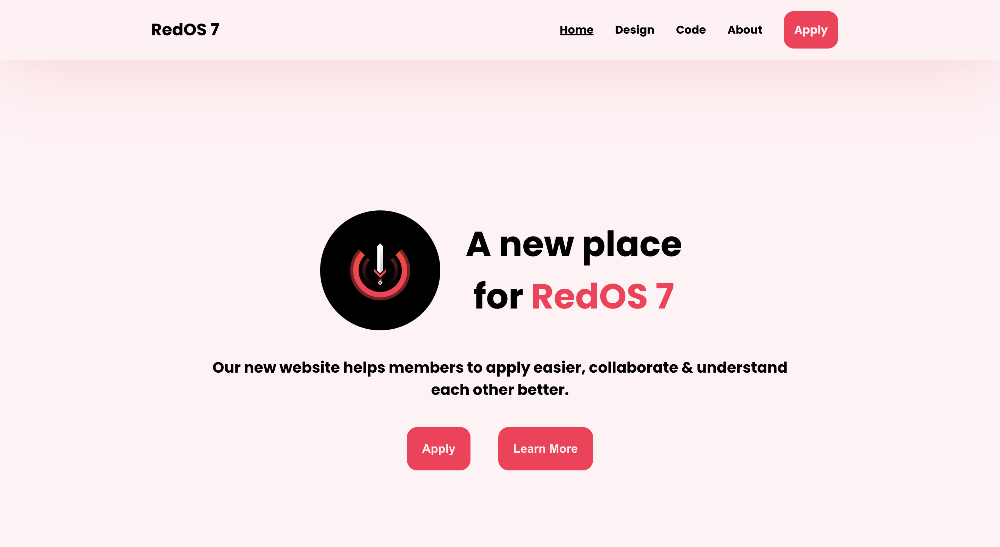

# 🎈 RedOS 7

## **The official website for RedOS 7**

[](https://redos7.netlify.app/)


## 🔐 Installation

In the project directory, you can run:
```bash
npm start
```
Runs the app in the development mode.
Open http://localhost:3000 to view it in your browser.

The page will reload when you make changes.
You may also see any lint errors in the console.

## 🎬 Usage

You can view the website [here](https://redos7.netlify.app/)

## 🏅 Features
- Displays the Red OS team
- Has small animations for each page
- Shows the current event and past events

## 💻 Technologies

- React.js
- HTML
- CSS

## 🧑‍💻 Team

- Just a solo project so far, but looking for others to collaborate with! Dm me on [discord](https://discord.com) @ hud*#7135.

## License
[MIT](https://choosealicense.com/licenses/mit/)
